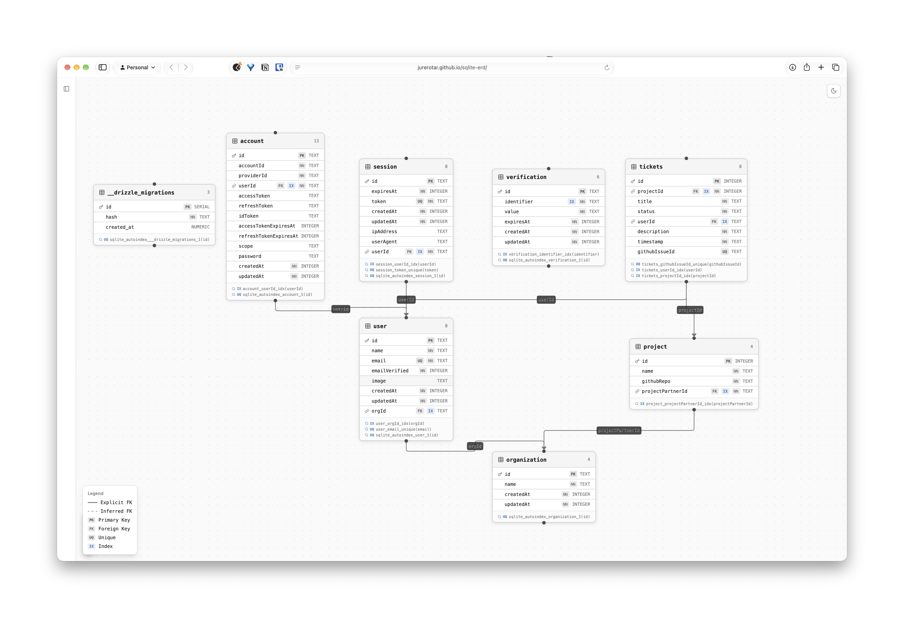

# Data model

This doc is a quick summary of ITS' data model, going over what we store, why it's needed, and also the semantics and implicit meanings of different db fields. Project members should try to keep this up to date as the database schema evolves over time.

Below is a entity-relationship diagram (ERD) - a way to visually see the tables, columns, and how they relate to each other. This is a screenshot generated from https://jurerotar.github.io/sqlite-erd/.

## Tables

### `user`

Better Auth base columns (`id, name, email, emailVerified, image, createdAt, updatedAt`), and `orgId`.

The `orgId` column has some special/implicit behaviors that are worth mentioning, it sort of behaves as a 'user role' column as well, in addition to tracking what organization a user may be a member of.

- When `orgId` is null: user is assumes a global 'admin' role. So they should be able to access everything in ITS: tickets from every org, invite new users, delete users, etc etc. In practice this should only be NPTS members.
- When `orgId` is set to a valid `organization.id`: user's access is scoped to that specific project partner, so they can only access that org's tickets and create tickets in that org.

### `organization`

`id, name, createdAt, updatedAt`

The partner record. There is one row per project partner, and both users and projects point at it.

### `session`, `account`, `verification`

The session table tracks user login sessions (basically the mechanism that keeps your browser signed in to ITS as you click around different pages, and tracks that your browser session is associated with your user. 

The account table is a better auth default table that we don't really use: normally better auth uses this if you're using email/password authentication OR social logins (ex: login with Google etc) but since we currently only use Email OTP auth this table remains dormant. might be worth deleting

<!--TODO: everything past this-->

verification table

### `project`

`id, name, githubRepo, projectPartnerId` → `organization.id` (`CASCADE`, indexed).

- `githubRepo` stores GitHub's `full_name` (e.g. `UTDallasEPICS/ITS`), which we can use to call the GitHub repo API.

### `tickets`

`id, projectId, title, status, userId, description, timestamp, githubIssueId`

- `projectId` → `project.id` (`CASCADE`, indexed). A ticket is meaningless without its project.
- `userId` → `user.id` (`SET NULL`, nullable, indexed). A ticket is project work and outlives its submitter, so deleting a user clears attribution rather than destroying history. Tickets are created by partners (REQ-F-09) and the embeddable widget (REQ-F-13) before any user need be attached.
- `githubIssueId` — nullable, unique. Set when the ticket is linked to a GitHub issue (REQ-F-14), which happens after the ticket exists. SQLite treats NULLs as distinct, so unlinked tickets coexist while no two tickets share an issue.
- `timestamp` stays text (SQLite decision, 9/26); `createdAt`/`updatedAt` elsewhere use integer timestamp mode.

